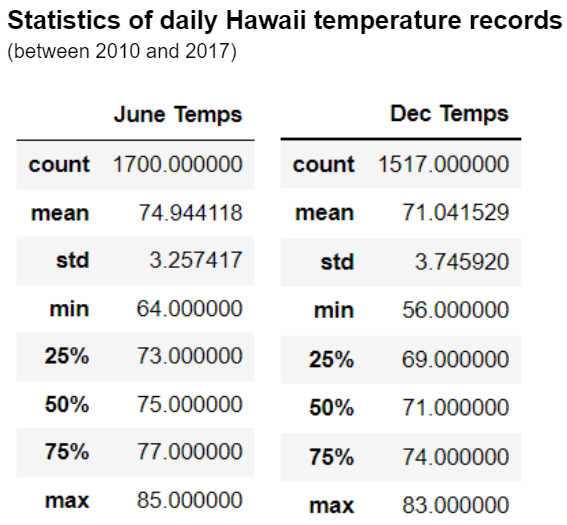

# Hawaii Weather Analysis

## Overview of the analysis:
Using Python, Pandas functions and methods, and SQLAlchemy, we will analyize Hawaii weather data between 2010 and 2017 for a business proposal.

## Results:
With the statistics of daily Hawaii temperature records in the table below, we observe:

* Hawaii has a temperate climate with temperature remains in the 70's year round.

* December temperatures tend to be a few degrees lower than June temperatures.

* December temerature variation is slighly larger than that of June.  December daily temperature standard deviation is slighly larger at 3.7 vs 3.3 in June.

## Summary:

From the daily temperature perspective, we believe a surf shop that also offer ice cream can be a good business idea in Hawaii.  Another weather factor to check is rainfall.  In below rainfall statistic table we can see December tend to be a weter month than June.  The good news is it seems Hawaii tend to be relatively dry year round.  Half of the days (50th percentile) have rainfall less than 0.03 inches.

