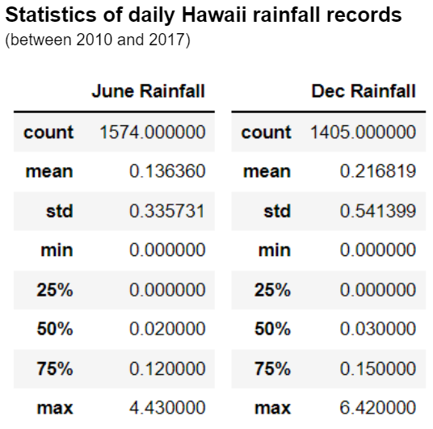

# Hawaii Weather Analysis

## Overview of the analysis:
Using Python, Pandas functions and methods, and SQLAlchemy, we will analyze Hawaii weather data between 2010 and 2017 for a business proposal.

## Results:
With the statistics of daily Hawaii temperature records in the table below, we observe:

* Hawaii has a temperate climate with temperatures remaining in the 70s year-round.

* December temperatures tend to be a few degrees lower than June temperatures.

* December temperature variation is slightly larger than that of June. December daily temperature standard deviation is slightly larger at 3.7 vs. 3.3 in June.

 

## Summary:

From the daily temperature perspective, we believe a surf shop that also offers ice cream can be a good business idea in Hawaii. Another weather factor to consider is rainfall. In the below rainfall statistic table we can see December tends to be a wetter month than June. The good news is it seems Hawaii tends to be relatively dry year round. Half of the days (50th percentile) have less than 0.03 inches of rainfall.  Thus, we can conclude that a surf & ice cream shop is unlikely to be impacted by the rainfall pattern in Hawaii.

 

